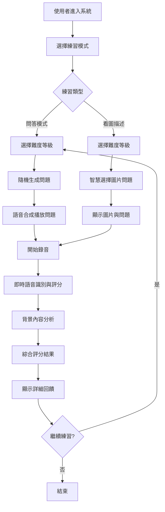

# 系統全面分析報告 - Cool English 英檢口說練習系統

## 1. 系統執行流程概述

### 系統架構比喻
想像這個系統就像一個**智慧的英語老師機器人**：
- **眼睛**：能看懂圖片（Azure Computer Vision）
- **耳朵**：能聽懂學生的英語發音（Azure Speech Recognition）
- **嘴巴**：能說出標準英語（Azure Text-to-Speech）
- **大腦**：能分析學生回答的內容質量（Azure OpenAI）
- **記憶**：能記住學生的練習歷史（瀏覽器存儲）

### 主要執行流程



## 2. 程式執行時引用的函數完整呈現

### 2.1 核心函數調用鏈

#### 認證與憑證管理
```typescript
// src/lib/azure/credential.ts
getAzureCredential() → fetchAzureCredential() → credentialIsValid()
// src/lib/server/azure/speech.ts  
getCredential() → fetch Azure Token API
```

#### 語音識別與合成
```typescript
// src/lib/azure/speech/recognizer.ts
Recognizer.start() → getAzureCredential() → SpeechSDK.SpeechRecognizer()
Recognizer.stop() → stopContinuousRecognitionAsync()
// src/lib/azure/speech/synthesizer.ts
Synthesizer.create() → getAzureCredential() → SpeechSDK.SpeechSynthesizer()
Synthesizer.synthesize() → synthesizeInternal() → playAudio()
```

#### 問題管理服務
```typescript
// src/lib/types/questionService.ts
getRandomQuestion() → Math.random() → Array.filter()
getRandomImageQuestion() → getFromSessionStorage() → resetUsedImages()
resetUsedImages() → sessionStorage.removeItem()
```

#### 評分系統
```typescript
// src/lib/grader.ts
Grader.scoreAnswer() → fetch('/api/grader/score-answer')
Grader.generateOverallFeedback() → fetch('/api/grader/overall-feedback')
// src/routes/api/grader/score-answer/+server.ts
POST handler → detectJailbreak() → openai.chat.completions.create()
```

#### 組件交互
```typescript
// src/lib/components/Recorder.svelte
startRecording() → recognizer.start()
handleResultUpdate() → onResultUpdate()
handleFinish() → onFinish()
```

### 2.2 系統初始化流程
1. `app.html` → 載入 Svelte 應用
2. `+layout.svelte` → 設置全域樣式
3. `+page.svelte` → 主頁面路由
4. 用戶選擇練習模式 → 導航到對應頁面
5. 頁面 `onMount()` → 初始化 Azure 服務

## 3. Microsoft Services 程式碼實作詳解

### 3.1 Azure Speech Services 憑證管理

**檔案位置**: `src/lib/server/azure/speech.ts:18-40`

```typescript
export async function getCredential() {
    // 使用 Azure Speech Key 向 Microsoft 認證服務請求 Token
    const res = await fetch(
        `https://${speechRegion}.api.cognitive.microsoft.com/sts/v1.0/issueToken`,
        {
            method: 'POST',
            headers: {
                'Ocp-Apim-Subscription-Key': speechKey,
                'Content-Type': 'application/x-www-form-urlencoded'
            }
        }
    );
    
    const token = await res.text();
    return { token, region: speechRegion };
}
```

**實作說明**: 
這個函數就像是**申請入場券**的過程。系統使用 Azure Speech Key（像是會員卡）向微軟的認證中心申請一張「臨時通行證」(JWT Token)，這張通行證允許系統在接下來的時間內使用語音服務。

### 3.2 語音識別與發音評估

**檔案位置**: `src/lib/azure/speech/recognizer.ts:25-165`

```typescript
async start(config: RecognizerConfig) {
    // 1. 取得 Azure 憑證
    const { token, region } = await getAzureCredential();
    
    // 2. 取得麥克風權限
    const stream = await navigator.mediaDevices.getUserMedia({ audio: true });
    
    // 3. 設置語音識別器
    const speechConfig = SpeechSDK.SpeechConfig.fromAuthorizationToken(token, region);
    speechConfig.speechRecognitionLanguage = 'en-US';
    
    // 4. 設置發音評估配置
    const assessmentConfig = new SpeechSDK.PronunciationAssessmentConfig(
        '',
        SpeechSDK.PronunciationAssessmentGradingSystem.HundredMark,
        SpeechSDK.PronunciationAssessmentGranularity.Phoneme,
        true
    );
    assessmentConfig.enableProsodyAssessment = true;
    
    // 5. 開始持續識別
    this.recognizer.startContinuousRecognitionAsync();
}
```

**實作說明**:
這個過程就像是**設置一個專業的英語聽力老師**：
1. 先確認老師的身份證明（取得憑證）
2. 確保能聽到學生說話（麥克風權限）
3. 告訴老師要聽什麼語言（英語設定）
4. 給老師一份評分標準（發音評估配置）
5. 老師開始專心聽講並評分

### 3.3 語音合成 (Text-to-Speech)

**檔案位置**: `src/lib/azure/speech/synthesizer.ts:35-89`

```typescript
async synthesize(text: string, autoPlay = false): Promise<void> {
    // 將文字分句處理
    const sentences = this.splitIntoSentences(text);
    
    for (const sentence of sentences) {
        // 使用 SSML 格式合成語音
        const ssml = `<speak version="1.0" xml:lang="en-US">
            <voice name="${this.voiceName}">${sentence}</voice>
        </speak>`;
        
        // 合成音訊
        this.synthesizer!.speakSsmlAsync(
            ssml,
            (result) => {
                if (result.audioData && autoPlay) {
                    this.playAudio(result.audioData);
                }
            },
            (error) => console.error('Synthesis error:', error)
        );
    }
}
```

**實作說明**:
這就像是**一個會說話的智慧音響**：
1. 把長文章拆成一句一句的小段落
2. 用特殊的語音標記語言 (SSML) 包裝每句話
3. 讓 Azure 的虛擬聲音演員來朗讀
4. 如果需要的話，立即播放給學生聽

### 3.4 Azure OpenAI 內容分析

**檔案位置**: `src/routes/api/grader/score-answer/+server.ts:61-86`

```typescript
const response = await openai.chat.completions.create({
    model: '',
    messages: [
        {
            role: 'system',
            content: `You are a professional English language teacher evaluating a student's response.
            評分標準:
            1. Vocabulary (richness, appropriateness, variety) - Score 0-100
            2. Grammar (correctness, complexity) - Score 0-100  
            3. Relevance (how well it addresses the topic/question) - Score 0-100
            4. Overall grade (0-5) based on the above scores.`
        },
        {
            role: 'user',
            content: [
                { type: 'text', text: `<QUESTION>${question.text}</QUESTION>` },
                { type: 'text', text: `<USER_ANSWER>${answer}</USER_ANSWER>` }
            ]
        }
    ],
    temperature: 0.2,
    response_format: zodResponseFormat(responseSchema, 'analysis')
});
```

**實作說明**:
這就像是**請一位 AI 英語老師來改作業**：
1. 給老師一份詳細的評分標準
2. 提供學生的問題和回答
3. 要求老師按照標準給分並提供建議
4. 確保回答格式標準化（使用 Zod schema 驗證）

## 4. Microsoft Services 資料回傳與計算統計

### 4.1 語音識別資料處理

**Azure Speech SDK 回傳的資料結構**:
```typescript
interface PronunciationAssessmentResult {
    accuracyScore: number;      // 準確度 0-100
    fluencyScore: number;       // 流暢度 0-100  
    completenessScore: number;  // 完整度 0-100
    prosodyScore: number;       // 韻律感 0-100
    pronunciationScore: number; // 總發音分數 0-100
}
```

**計算轉換邏輯** (`src/routes/question-answering/+page.svelte:60-66`):
```typescript
function handleResult({ accuracyScore, fluencyScore, prosodyScore }) {
    // 計算三項平均分數
    const avg = Math.round((accuracyScore + fluencyScore + prosodyScore) / 3);
    
    // 轉換為 0-5 分制
    const total = parseFloat((avg / 20).toFixed(2));
    
    speech = {
        accuracy: Math.round(accuracyScore),
        fluency: Math.round(fluencyScore), 
        prosody: Math.round(prosodyScore),
        total: total  // 最終語音分數
    };
}
```

### 4.2 內容評分資料處理

**OpenAI API 回傳格式**:
```json
{
    "vocabulary": 85,
    "grammar": 78,
    "relevance": 92,
    "grade": 4.2,
    "feedback": "你的回答展現了豐富的詞彙運用..."
}
```

**統計計算** (`src/routes/question-answering/+page.svelte:91-96`):
```typescript
// 將 API 回傳資料對應到內部格式
content = {
    vocabulary: data.vocabulary,    // 詞彙豐富度 0-100
    grammar: data.grammar,          // 文法正確性 0-100
    relevance: data.relevance,      // 相關性 0-100
    total: data.grade               // 內容總分 0-5
};

// 計算最終總分
assessment = {
    speech,
    content,
    overallScore: Math.round((speech.total + content.total) * 10), // 0-100分制
    feedback: data.feedback
};
```

### 4.3 綜合統計邏輯

**分數權重系統**:
- 語音分數 (50%): 準確度 + 流暢度 + 韻律感 / 3
- 內容分數 (50%): 詞彙 + 文法 + 相關性，由 AI 綜合評估
- 最終分數: (語音總分 + 內容總分) × 10

**即時統計更新** (`src/lib/components/Recorder.svelte:120-150`):
```typescript
// 加權平均計算多次錄音的分數
const updateWeightedScores = (newScores: SpeechScores) => {
    totalSegments++;
    const weight = 1.0 / totalSegments;
    const prevWeight = 1.0 - weight;
    
    // 使用加權平均更新分數
    weightedScores = {
        accuracy: weightedScores.accuracy * prevWeight + newScores.accuracy * weight,
        fluency: weightedScores.fluency * prevWeight + newScores.fluency * weight,
        // ...其他分數項目
    };
};
```

## 5. 每一個函式詳細解釋

### 5.1 認證管理函式

#### `getAzureCredential()` - Azure 憑證快取管理器
**位置**: `src/lib/azure/credential.ts:9-18`
**比喻**: 就像是一個**智慧門禁卡管理員**
- **功能**: 檢查現有的門禁卡是否還有效，如果過期就申請新的
- **邏輯**: 使用 Promise 快取避免重複申請，JWT token 過期前自動更新
- **回傳**: `{ token: string, region: string }`

#### `credentialIsValid()` - 憑證有效性檢驗器  
**位置**: `src/lib/azure/credential.ts:30-50`
**比喻**: 就像是**檢查身份證有效期的警衛**
- **功能**: 解析 JWT token，檢查是否在有效期限內
- **技術**: Base64 解碼 JWT payload，比較 exp 時間戳
- **特色**: 提供詳細的除錯日誌，顯示 token 過期時間

### 5.2 語音處理函式

#### `Recognizer.start()` - 語音識別啟動器
**位置**: `src/lib/azure/speech/recognizer.ts:25-165`
**比喻**: 就像是**啟動一個專業的英語聽力檢測儀**
- **步驟1**: 取得 Azure 憑證 (申請使用權限)
- **步驟2**: 請求麥克風權限 (連接音訊輸入)
- **步驟3**: 設置音訊分析器 (即時音量監測)
- **步驟4**: 配置語音識別器 (英語、詳細輸出格式)
- **步驟5**: 啟用發音評估 (音素級別、韻律評估)
- **步驟6**: 設置事件處理器 (識別中、識別完成、錯誤處理)
- **特色**: 支援自定義靜音超時、片語清單、主題設定

#### `Synthesizer.synthesize()` - 語音合成引擎
**位置**: `src/lib/azure/speech/synthesizer.ts:35-89`
**比喻**: 就像是**一個會說多種聲音的播音員**
- **智慧分句**: 使用正則表達式將長文本分解成句子
- **SSML 包裝**: 用語音合成標記語言指定聲音特性
- **緩衝管理**: 處理部分句子，避免截斷問題
- **音訊控制**: 支援自動播放和手動控制

### 5.3 問題管理函式

#### `getRandomQuestion()` - 問題隨機選擇器
**位置**: `src/lib/types/questionService.ts:85-89`
**比喻**: 就像是**一個智慧題庫管理員**
- **過濾邏輯**: 根據難度等級篩選適合的問題
- **隨機算法**: 使用 `Math.random()` 確保問題分佈均勻
- **簡單直接**: 不記錄歷史，每次都可能重複

#### `getRandomImageQuestion()` - 智慧圖片問題選擇器
**位置**: `src/lib/types/questionService.ts:91-126`
**比喻**: 就像是**一個記憶力超強的題庫助理**
- **記憶系統**: 使用 sessionStorage 記錄已使用的問題
- **避免重複**: 優先選擇未使用過的問題
- **自動重置**: 當所有問題都用完時自動清空記錄
- **智慧回退**: 如果沒有適合難度的問題，提供預設選項

### 5.4 評分系統函式

#### `Grader.scoreAnswer()` - 內容評分呼叫器
**位置**: `src/lib/grader.ts:54-112`
**比喻**: 就像是**學生和 AI 老師之間的翻譯官**
- **資料轉換**: 將前端問題格式轉換為 API 格式
- **圖片支援**: 自動檢測並包含圖片 URL
- **錯誤處理**: 完整的 try-catch 和日誌記錄
- **格式標準化**: 將 API 回應轉換為應用程式內部格式

#### `detectJailbreak()` - 安全防護檢測器
**位置**: `src/lib/server/utils/jailbreak.ts:5-25`
**比喻**: 就像是**一個網路安全守門員**
- **關鍵字檢測**: 掃描可能的惡意提示詞
- **模式匹配**: 識別嘗試繞過 AI 限制的字句
- **非同步處理**: 不阻塞主要處理流程
- **日誌記錄**: 記錄可疑活動供後續分析

### 5.5 UI 組件函式

#### `Recorder` 組件核心方法
**位置**: `src/lib/components/Recorder.svelte:85-200` 
**比喻**: 就像是**一個多功能錄音控制台**

- **`startRecording()`**: 錄音開始控制器
  - 初始化錄音狀態
  - 啟動語音識別器
  - 開始音訊錄製

- **`stopRecording()`**: 錄音停止控制器
  - 停止所有錄音活動
  - 處理最終結果
  - 觸發完成回調

- **`updateWeightedScores()`**: 分數加權計算器
  - 實現動態加權平均算法
  - 平衡多次錄音片段的分數
  - 提供平滑的分數變化

### 5.6 頁面生命週期函式

#### `onMount()` - 組件初始化器
**各頁面的 onMount 實作**:
- **問答頁面**: 初始化語音合成器，設定英語女聲
- **圖片描述頁面**: 載入圖片問題，設置評分系統
- **主頁面**: 設定導航和樣式主題

#### 狀態管理函式
**使用 Svelte 5 的 $state 響應式系統**:
```typescript
let stage = $state('landing');           // 頁面狀態控制
let difficulty = $state('beginner');     // 難度選擇
let assessment = $state(null);           // 評分結果
```

## 6. 系統使用方法

### 6.1 系統啟動

1. **環境要求**:
   - Node.js 18+ 
   - 現代瀏覽器 (支援 WebRTC)
   - 麥克風權限

2. **啟動步驟**:
   ```bash
   # 安裝依賴
   pnpm install
   
   # 設置環境變數 (.env 檔案)
   AZURE_SPEECH_KEY=your_speech_key
   AZURE_SPEECH_REGION=your_region
   AZURE_OPENAI_ENDPOINT=your_openai_endpoint
   AZURE_OPENAI_API_KEY=your_api_key
   AZURE_OPENAI_API_VERSION=2024-02-15-preview
   DEPLOYMENT=your_deployment_name
   
   # 啟動開發伺服器
   pnpm dev
   ```

3. **存取系統**:
   - 開啟瀏覽器訪問 `http://localhost:5173`
   - 允許麥克風權限請求

### 6.2 練習流程

#### A. 問答練習模式
1. **選擇模式**: 點擊首頁「回答問題測驗」
2. **選擇難度**: beginner/intermediate/high-intermediate/advanced
3. **聆聽問題**: 系統會播放英語問題兩次
4. **開始回答**: 看到麥克風圖示後開始說話
5. **即時回饋**: 系統顯示語音識別結果
6. **獲得評分**: 查看發音和內容分數
7. **繼續練習**: 選擇重試或下一題

#### B. 圖片描述模式  
1. **選擇模式**: 點擊首頁「看圖敍述測驗」
2. **選擇難度**: 系統會篩選適合的圖片問題
3. **預覽圖片**: 仔細觀察圖片內容和問題
4. **開始描述**: 按下錄音按鈕開始描述
5. **多題練習**: 系統自動避免重複問題
6. **綜合評估**: 獲得整體表現回饋

### 6.3 評分系統解讀

#### 語音評分 (Speech Assessment)
- **Accuracy (準確度)**: 單字發音正確性 0-100
- **Fluency (流暢度)**: 語速和停頓自然度 0-100  
- **Prosody (韻律感)**: 語調和重音表現 0-100
- **Total**: 三項平均分數轉換為 0-5 分制

#### 內容評分 (Content Assessment)  
- **Vocabulary (詞彙)**: 詞彙豐富度和適當性 0-100
- **Grammar (文法)**: 語法正確性和複雜度 0-100
- **Relevance (相關性)**: 回答切題程度 0-100
- **Total**: AI 綜合評估的 0-5 分制分數

#### 總分計算
- **Overall Score**: (語音分數 + 內容分數) × 10 = 0-100 分制
- **詳細回饋**: 中文建議和改進方向

### 6.4 進階功能

#### 自訂練習設定
- **錄音時長**: 最長 15 秒（可在程式碼中調整）
- **靜音檢測**: 自動停止錄音當檢測到長時間靜音
- **重複練習**: 同一題目可重複練習直到滿意

#### 問題管理
- **智慧選題**: 避免短時間內重複相同問題
- **難度適應**: 根據選擇的等級提供合適問題
- **歷史記錄**: 使用瀏覽器 sessionStorage 追蹤練習狀況

### 6.5 疑難排解

#### 常見問題
1. **麥克風無法使用**: 檢查瀏覽器權限設定
2. **語音識別不準確**: 確保環境安靜，發音清晰
3. **評分過程緩慢**: 檢查網路連線和 Azure 服務狀態
4. **圖片無法載入**: 檢查 Unsplash API 連線狀況

#### 系統監控
- **除錯模式**: 開啟瀏覽器開發者工具查看詳細日誌
- **效能監控**: 觀察網路請求和 API 回應時間
- **錯誤追蹤**: 系統會記錄所有錯誤和異常狀況

---

**系統版本**: v0.0.1  
**技術棧**: SvelteKit + TypeScript + Azure AI Services  
**開發狀態**: 活躍開發中  
**最後更新**: 2025-08-04